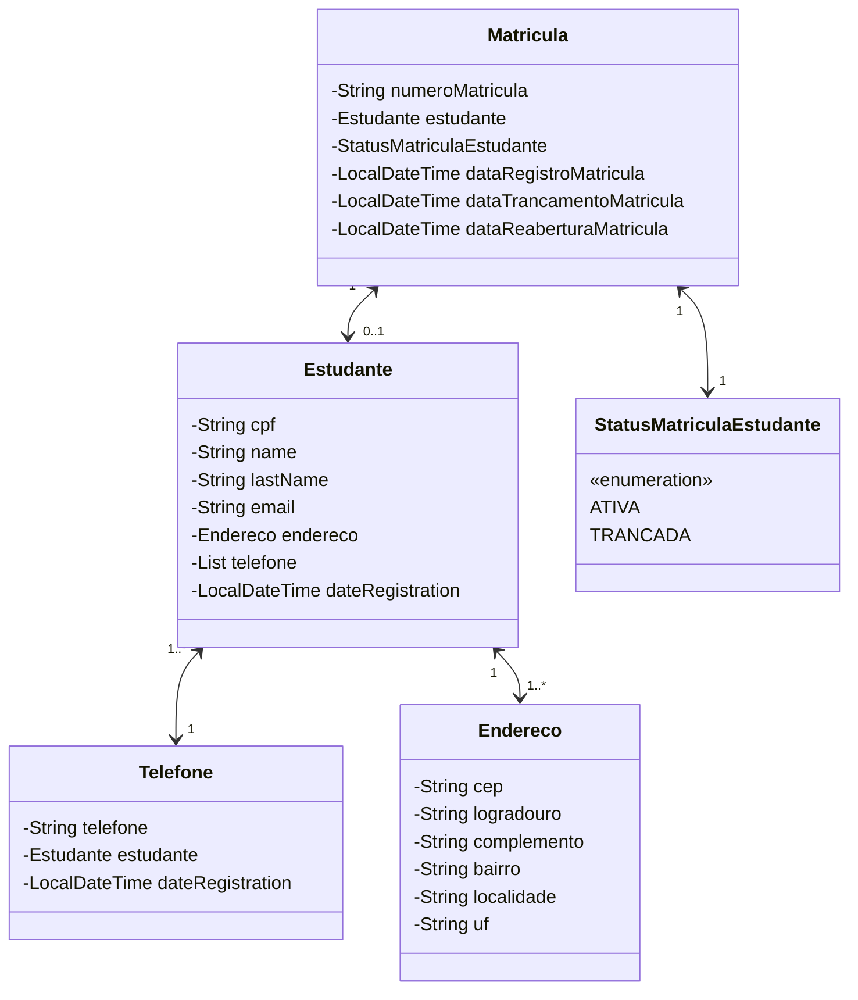

# Api Matrícula
## Projeto API Restful elaborado para teste de desenvolvedor Backend.

## Índice
- <a href="#sobreDescricao">Sobre o Desafio</a>
- <a href="#diagrama">Diagrama de classe</a>
- <a href="#funcionalidades">Funcionalidades do projeto</a>
- <a href="#demonstracao">Demonstração</a>
- <a href="#rodar">Como rodar este projeto?</a>
- <a href="#tecnologias">Tecnologias Utilizadas</a>
- <a href="#autoras">Pessoas Autoras</a>
- <a href="#proximospassos">Próximos passos</a>

<h2 id="sobreDescricao">Sobre a Api</h2>
Este projeto consiste no desenvolvimento de uma API para gerenciamento acadêmico, oferecendo funcionalidades relacionadas a matrículas, estudantes e seus telefones. No módulo de Matrículas, a API permite ações como trancar, reabrir, listar (todas, ativas ou trancadas) e buscar matrículas por número ou CPF. O módulo de Estudantes inclui operações para criar, atualizar e excluir registros de alunos, além de listar todos os estudantes ou buscar um aluno específico pelo CPF. Já no módulo de Telefones, é possível gerenciar os contatos dos estudantes, incluindo a criação, listagem (geral ou por aluno), busca por número, além de permitir a remoção de telefones individuais ou de todos os telefones de um aluno. Este projeto visa facilitar o gerenciamento e a organização das informações acadêmicas e de contato de estudantes.
<h2 id="diagrama">Diagrama de classes</h2>



<h2 id = "funcionalidades"> 🖥️Funcionalidades do Projeto </h2>

| Matrícula                               | Estudante                          | Telefone                             |
|-----------------------------------------|------------------------------------|--------------------------------------|
| [x] Trancar matrícula.                  | [x] Atualiza dados do Estudante.       | [x] Lista todos os telefones.            |
| [x] Reabrir matrícula.                      | [x] Lista com todos os estudantes.     | [x] Cria um novo Telefone.               |
| [x] Listar todas as matrículas.             | [x] Cria novo Estudante.               | [x] Busca telefone pelo número.          |
| [x] Criar uma nova matrícula.               | [x] Busca estudante pelo CPF.          | [x] Lista todos os telefones do aluno.   |
| [x] Buscar matrícula pelo número.           | [x] Apaga o registro do estudante.     | [x] Remove o telefone pelo Id.           |
| [x] Buscar matrícula pelo CPF do estudante. |                                    | [x] Remove todos os telefones do aluno.  |
| [x] Listar matrículas trancadas.            |                                    |                                      |
| [x] Listar matrículas ativas.               |                                    |                                      |


## 📺Layout


<h2 id="demonstracao"> Demonstração </h2>

[Projeto]


<h2 id="rodar">💿Como Rodar este projeto</h2>

```bash
# Clone o repositório 
$ git clone https://github.com/reynaldo-hendson/Teste_Desenvolvedor_Backend.git

# Acesse a pasta do projeto
$ cd Teste_Desenvolvedor_Backend

# Instale as dependências
$ mvn clean install

# Execute o projeto
Abra o projeto na IDE de sua preferência.

# Configurações Adicionais:
Se o projeto usa um banco de dados, certifique-se de configurar as informações de conexão no arquivo de configuração.

Consulte o arquivo application.properties (ou application.yml) para configurar outras propriedades da aplicação, como porta, URL da base de dados, é os ambientes.

```
<h2 id="tecnologias">🛠️Tecnologias Utilizadas</h2>

1. [Java 17](https://www.java.com/pt-BR/)
2. [Spring Boot 3](https://spring.io/projects/spring-boot)
3. [ViaCEP](https://viacep.com.br/)
4. [SpringDoc (Swagger)](https://springdoc.org/)
5. [Spring Cloud OpenFeign](https://docs.spring.io/spring-cloud-openfeign/docs/current/reference/html/)
6. [MapStruct](https://mapstruct.org/)
7. [Docker](https://www.docker.com/)
8. [Flyway](https://www.red-gate.com/products/flyway/community/)
9. [PostgreSQL](https://www.postgresql.org/)
10. [Postman](https://www.postman.com/)

<h2 id="autoras">👤Pessoas Autoras</h2>

<table>
  <tr>
    <td>
      <a href="#">
        <br>
        <sub>
          <b>Reynaldo Hendson</b>
        </sub>
      </a>
    </td>
  </tr>
</table>

[Linkedin](https://www.linkedin.com/in/reynaldo-hendson/)

<h2 id="proximospassos"> 🖊️Próximos passos </h2>

- [] Implementar camada de segurança.
- [] Implementar notificação via email
- [] Implementar Frontend

